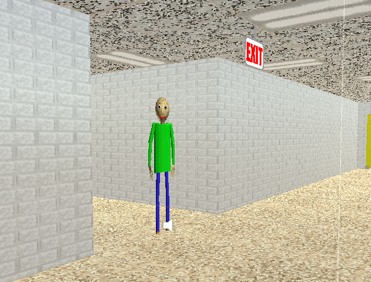

# Baldi's Basics Classic V1.2.2 Decompile
A decompile of BBC V1.2.2

[Download Classic 1.2.2](https://basically-games.itch.io/baldis-basics)

[Download Project Files](https://github.com/SillyMonkeyFlip/Baldi-s-Basics-1.2.2-Decompile/releases)

[Play WebGL Version](https://sillymonkeyflip.github.io/Baldi-s-Basics-1.2.2-Decompile/)

## Information
- Unity version is 2018.2.21 (Converted by me, you should be able to downgrade it tho)
- Scriping backend is mono

## Credits
- Mystman12 - Creating Baldis Basics
- SillyMonkeyFlip - Decompile + WebGL Compile

## Media

